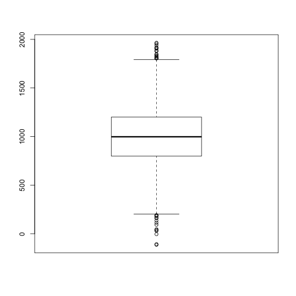

Make a boxplot: a small application to learn Slidify.
========================================================
author: 
date: 

Objectives
========================================================


- To learn a bit about Slidify
- Draw a random sample from a normal distribution after setting the parameters: number of observations, mean, standard deviation
- Construct a boxplot in a reactive way meaning each time the parameters get changed

Draw a random sample from a normal distribution
========================================================


In order to draw a random sample:
- Enter the number of observations
- Enter the mean
- Enter the standard deviation

R code for drawing the sample
========================================================


```r
obs<-5000   #number of observations
m<-1000     #mean
s<-300      #standard deviation
d<-rnorm(obs,mean=m,sd=s) #draw the sample
summary(d) #sample summary
```

```
   Min. 1st Qu.  Median    Mean 3rd Qu.    Max. 
   -114     798     998    1000    1200    1970 
```

Construct boxplot
========================================================


```r
boxplot(d)
```

 

